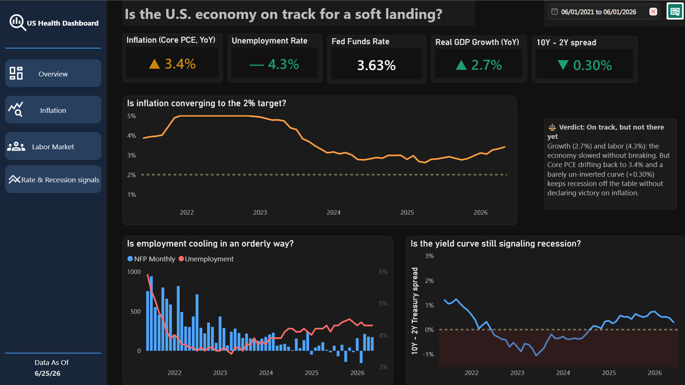
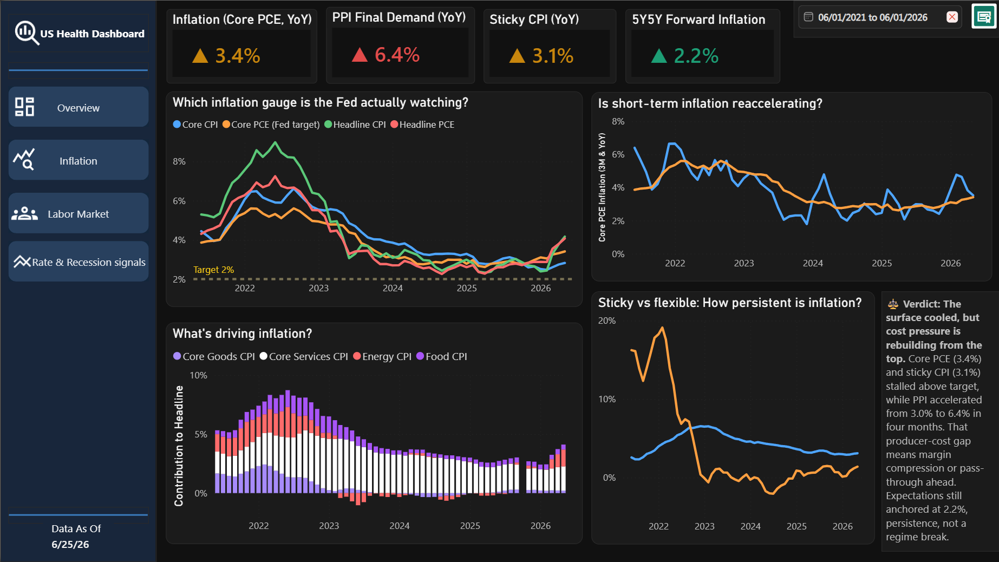
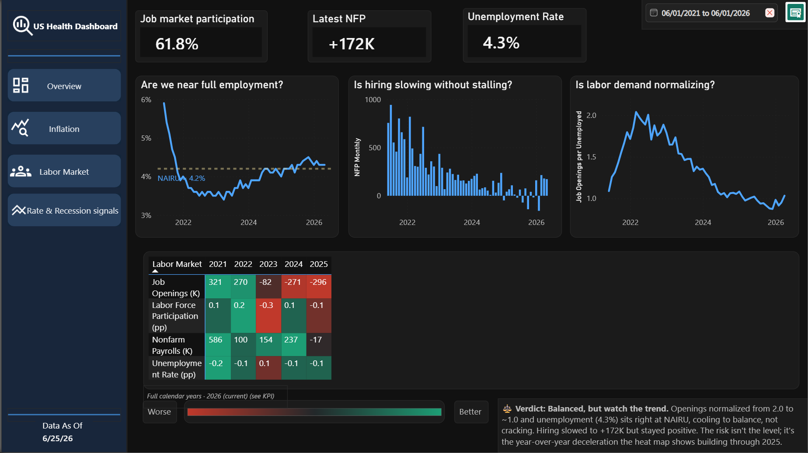
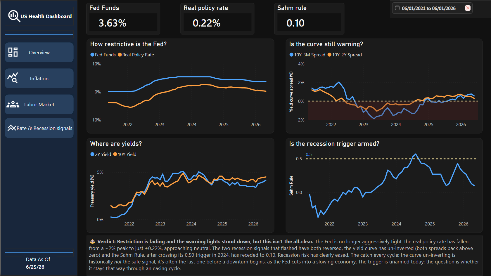

# U.S. Macro Health Dashboard 🇺🇸📊

**Is the U.S. economy on track for a soft landing?** An interactive Power BI dashboard that tracks inflation, the labor market, and recession signals using primary-source data from the Federal Reserve (FRED) - built to answer one question, not just display numbers.


> Data as of **June 2026**. Every figure below matches the screenshots in this repo.



---

## 🎯 The question

In 2026 the central economic debate is whether the Federal Reserve managed the rare feat of a *soft landing* - bringing inflation back toward its 2% target **without** tipping the economy into recession. This dashboard turns that debate into a measurable, monitorable scorecard built from primary-source data.

Rather than a wall of charts, every visual title is a *business question*, and every page ends with an explicit **verdict**.

---

## 🧭 Key findings (June 2026 build)

- **Inflation cooled on the surface, but pressure is rebuilding.** Core PCE - the Fed's preferred gauge - sits at **3.4%**, still above the 2% target, and **Sticky CPI at 3.1%** has stalled rather than continued falling. The upstream warning: **PPI Final Demand accelerated to 6.4% YoY**, suggesting cost pressure is coming back through the pipeline. Long-run expectations remain anchored (**5Y5Y forward at 2.2%**).
- **The labor market is cooling to balance, not cracking.** Payrolls still grew (**+172K** latest NFP), unemployment is drifting up to **4.3%** rather than spiking, and participation holds at **61.8%**. Job openings per unemployed have normalized from pandemic-era highs back toward ~1.0.
- **Policy restriction is fading and recession signals are quiet.** The Fed funds rate is **3.63%**, leaving a **real policy rate of just 0.22%** close to neutral. The **10Y-2Y curve is positive (+0.30%)**, no longer inverted, and the **Sahm Rule reads 0.10**, far below the 0.50 recession trigger.

> ### ⚖️ Verdict: **on track, but not there yet**
> The economy slowed without breaking and recession signals are off the table - but with Core PCE at 3.4%, Sticky CPI stuck at 3.1%, and PPI re-accelerating, it's too early to declare victory on inflation. A soft landing in progress, not yet a soft landing achieved.

---

## 🖥️ Dashboard walkthrough

One executive overview plus three deep-dive pages, with a left-hand button navigation panel.

### 1. Soft Landing Scorecard *(overview)*
A five-KPI hero row with semantic color (green = healthy, amber = watch, red = alert), the three soft-landing pillar charts (inflation convergence, employment cooling, yield-curve signal), and the headline verdict.


### 2. Inflation Deep Dive
Goes beyond headline numbers to the persistence indicators an analyst actually watches: which gauge the Fed targets (Core PCE vs CPI), short-term momentum, component contribution to headline, and sticky vs. flexible CPI. Narrates the transmission hierarchy - goods adjust in months, services over quarters, shelter takes over a year.



### 3. Labor Market
Payrolls, participation, unemployment, and the job-openings-per-unemployed ratio the Fed uses to read labor-market tightness, with a year-over-year heat-map table (2021-2025).



### 4. Rates & Recession Signals
Fed funds and the real (inflation-adjusted) policy rate, Treasury yields, the yield-curve spread, and the real-time Sahm Rule recession indicator.



---

## 🛠️ Data & methodology

**Source.** All data comes from [FRED](https://fred.stlouisfed.org/) (Federal Reserve Economic Data, St. Louis Fed) - ~30 primary-source macroeconomic series, pulled via the FRED API.

**Extraction.** A Python script (`fred_extract.py`) pulls every series with `fredapi`, handles mixed frequencies (daily yields, monthly CPI, quarterly GDP), fails gracefully per-series, and outputs a clean **star schema**:

| File | Role |
|------|------|
| `fact_observations.csv` | Long/tidy fact table - `date, series_id, value` |
| `dim_series.csv` | Series dimension - id, name, theme, units, frequency |
| `dim_calendar.csv` | Daily date dimension |

**Modeling.** One-to-many relationships flow from the dimensions into the fact table; the calendar is marked as a date table to enable time intelligence.

**Measures.** A library of DAX measures handles year-over-year and 3-month-annualized transforms, cross-series calculations (real policy rate, job-openings ratio), and semantic-color logic. The long-format design means a *single* measure can render multiple series at once via legend context.

---

## ▶️ Reproduce it yourself

There are **two ways** to explore this project, depending on whether you just want to see the dashboard or rebuild the data from scratch.

### Option A - Open the dashboard as-is *(fastest)*
The repository already ships with the generated star-schema data in `output/`, so you can see the dashboard exactly as I built it with no setup:

```bash
git clone https://github.com/davidpedrazagon-XXIII/us-macro-health-dashboard
```

Then just open `Economic_Analysis.pbix` in Power BI Desktop - it loads straight from the bundled CSVs.

### Option B - Rebuild the data live from FRED
If you'd rather pull fresh data yourself, run the extraction script with your own free FRED API key:

```bash
# 1. Install dependencies
pip install fredapi pandas

# 2. Get a free FRED API key at:
#    https://fredaccount.stlouisfed.org/apikeys

# 3. Run the extractor 
python fred_extract.py 

# 4. Open Economic_Analysis.pbix and refresh
```

---

## 📁 Repository structure

```
us-macro-health-dashboard/
├── README.md
├── LICENSE                         # MIT
├── fred_extract.py                 # FRED extraction → star-schema CSVs
├── Economic_Analysis.pbix          # the Power BI report
├── output/                         # generated star-schema CSVs
│   ├── fact_observations.csv
│   ├── dim_series.csv
│   └── dim_calendar.csv
├── 01-overview.png                 # screenshots referenced above
├── 02-inflation.png
├── 03-labor.png
├── 04-rates.png
└── .gitignore
```

---

## 💡 What this project demonstrates

- **Data modeling** - a proper star schema, not a flat dump.
- **DAX & time intelligence** - YoY, MoM, 3-month annualized, cross-series and semantic-color measures.
- **API data engineering** - reproducible extraction in Python with per-series error handling.
- **Data storytelling** - every visual answers a question; every page reaches a verdict.
- **Domain knowledge** - reads inflation the way an economist does (sticky CPI, PPI pipeline, transmission lags, Sahm Rule and yield-curve recession signals).

---

## 👤 About

**Jairo David Pedraza González** - Industrial Engineer and Process / Data Analyst, working at the intersection of data analytics and process improvement.

🔗 [LinkedIn](https://www.linkedin.com/in/david-pedraza-gon/)

---

## 📄 License

Released under the [MIT License](LICENSE) - free to use, modify, and share with attribution.

---

<sub>Data: Federal Reserve Economic Data (FRED), Federal Reserve Bank of St. Louis - free and publicly available. This project is for educational and portfolio purposes and is not investment advice.</sub>
